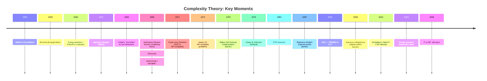

# From Hilbert to NP-Complete: A CS Student's Tour of Complexity Theory

*A field that started as a question about the limits of mathematics, and grew into the deepest open problem in computer science.*

---

## The Letter Nobody Read for Thirty Years

In March 1956, a frail Kurt Gödel wrote a letter to John von Neumann, who was dying of cancer. Buried in the letter is this passage:

> *"If there really were a machine with [running time] $\varphi(n) \sim k \cdot n$ ... this would have consequences of the greatest importance. Namely, it would obviously mean that ... the mental work of a mathematician concerning Yes-or-No questions could be completely replaced by a machine."*

Gödel was describing what we now call **P vs NP** — fifteen years before Stephen Cook gave it a name. The letter was forgotten until 1988. By then, complexity theory had been a field for two decades, the question had a million-dollar prize attached to it, and nobody had any idea how to answer it.

That gap — between a natural question and a formal answer — is the story of complexity theory. Let's walk through it.

---

## Pre-History: Before You Can Ask "How Hard?", You Need "Computable"

In 1928, David Hilbert posed the **Entscheidungsproblem**: is there a mechanical procedure that, given any statement in first-order logic, decides whether it's a theorem?

This sounds abstract, but it was the cleanest possible version of a question mathematicians had been circling for decades: *can math be automated?*

The answer came in 1936, simultaneously, from two directions:

- **Alonzo Church** invented the **λ-calculus** and showed his system could not decide every logical statement.
- **Alan Turing**, in *On Computable Numbers, with an Application to the Entscheidungsproblem*, defined the **Turing machine** and proved the **Halting Problem** undecidable.

The Church–Turing thesis was born: *anything we'd reasonably call "computable" is computable by a Turing machine.* This is not a theorem — it's an empirical claim that has held up for ninety years.

Crucially, Turing didn't just answer Hilbert's question with "no." He gave us a **formal model of computation**. You cannot ask "how many steps does this algorithm take?" until you've defined what a step *is*. Everything that follows depends on this.

---

## The 1960s: Algorithm Analysis Becomes a Discipline

For thirty years after Turing, "an algorithm runs in $n^2$ time" was hand-waving. There was no agreement on:

- What counts as a "step"?
- What counts as "fast"?
- How do we compare two algorithms when one wins on small inputs and the other on large?

Three things changed this in a single decade.

**Big-O notation arrives in CS (1976, but really 1894).** The notation $O(f(n))$ was introduced by **Paul Bachmann** in 1894 for analytic number theory and refined by **Edmund Landau** in 1909. **Donald Knuth's** 1976 *SIGACT News* paper *"Big Omicron and big Omega and big Theta"* standardized $O$, $\Omega$, $\Theta$ for computer science. This is why Big-O feels older than computer science itself — it is.

**Edmonds defines "tractable" (1965).** In *Paths, Trees, and Flowers*, Jack Edmonds introduced a now-obvious idea: **polynomial time is the right bar for "efficient."** Why? Because polynomial-time algorithms compose (the composition of two polynomial-time algorithms is polynomial-time), they're robust to changes in the model of computation, and they match practical experience. Edmonds called this the "good algorithm" thesis. Today we call it **the class P**.

**Hartmanis and Stearns name the field (1965).** *On the computational complexity of algorithms* introduced the **time hierarchy theorem**, the first non-trivial separation between complexity classes. The result, in plain English:

> *More time strictly buys you more computational power.*

Formally: for "nice" functions $f$, there exist languages decidable in $O(f(n))$ time but not in $o(f(n) / \log f(n))$ time. The proof is a diagonalization argument — you build a machine that simulates every machine running in $f(n)/\log f(n)$ time and disagrees with each on at least one input. It's the only known *unconditional* separation between standard time classes. We know $\text{P} \subsetneq \text{EXP}$ because of this theorem and nothing else. Hartmanis and Stearns won the 1993 Turing Award for it.

---

## The Big Bang: Cook, Levin, Karp (1971–1972)

Now the famous part. By 1970, complexity theorists had a healthy theory of *what* is computable in polynomial time, but no theory of *what isn't*. Then three papers, in three years, lit the field on fire.

**Cook (1971).** Stephen Cook's *The Complexity of Theorem-Proving Procedures* defined the class **NP** (decision problems whose "yes" answers have polynomial-size proofs verifiable in polynomial time) and proved that **SAT** — the satisfiability problem for Boolean formulas — is at least as hard as every problem in NP. This is the **Cook–Levin theorem**. SAT is **NP-complete**.

The proof sketch is worth understanding because it's *constructive*. Given any non-deterministic Turing machine $M$ running in time $p(n)$, Cook shows how to mechanically translate "$M$ accepts input $x$" into a Boolean formula $\varphi_{M,x}$ whose satisfying assignments correspond exactly to accepting computations. The formula has clauses encoding:

1. The initial configuration matches $x$.
2. Each step is a valid transition of $M$.
3. The final configuration is accepting.

The formula is polynomial in $|x|$. So if you could solve SAT fast, you could solve *every* NP problem fast. SAT is NP's universal benchmark.

**Levin (1973, USSR).** Leonid Levin proved essentially the same theorem independently, in the Soviet Union, with no knowledge of Cook's work. (This is why we say "Cook–Levin," not just "Cook.") Levin's framing was different — he was thinking about *search* problems and universal search algorithms — but the content overlapped almost perfectly. Cold War science at its purest.

**Karp (1972).** Richard Karp's *Reducibility Among Combinatorial Problems* is the paper that made NP-completeness *useful*. Karp took 21 problems from across operations research, graph theory, and logic — Vertex Cover, Hamiltonian Circuit, Traveling Salesman, Set Cover, Knapsack, Clique, ... — and showed all of them are NP-complete via polynomial-time reductions to and from SAT.

The cultural impact was enormous. Suddenly:

- Every CS researcher had a checklist of "is my problem one of these 21 (or one reducible to them)?"
- "I can't find a polynomial algorithm" became a respectable result, not a personal failure — provided you could exhibit an NP-completeness reduction.
- **Garey and Johnson's 1979 textbook** *Computers and Intractability* turned this into an industry. Its appendix lists 300+ NP-complete problems. It is the single most-cited book in computer science.

---

## The Foundations You Actually Need

Here's a working CS student's mental model, deeper than the cheat sheet.

### Reductions are the central tool

A polynomial-time **reduction** $A \leq_p B$ is an algorithm that transforms instances of $A$ into instances of $B$, in polynomial time, preserving the yes/no answer. It says: *if you can solve $B$ fast, you can solve $A$ fast.* Equivalently: *if $A$ is hard, $B$ is at least as hard.*

Reductions work in both directions:
- **Algorithm design** (upper bound): Reduce your weird new problem to one with a known fast algorithm. Win.
- **Hardness** (lower bound): Reduce a known-hard problem (3-SAT, Vertex Cover, ...) to your problem. Now your problem is hard too.

Cook–Levin gives you a "universal hardness anchor" — SAT — so every other reduction can chain back to it.

### The class hierarchy

```
                ┌──── P ⊆ NP ⊆ PSPACE ⊆ EXP
                │
  Known strict: P ⊊ EXP        (time hierarchy theorem)
  Known strict: NL ⊊ PSPACE    (space hierarchy theorem)

  Wide open:    P =? NP
                NP =? PSPACE
                P =? PSPACE
```

We know exactly **two** unconditional strict separations between standard classes — both from hierarchy theorems. Every other inclusion you've seen drawn as $\subsetneq$ in a textbook is a conjecture.

This is genuinely shocking when you first internalize it. We have spent fifty years and we cannot prove that $\text{P} \neq \text{PSPACE}$, even though the latter contains games like generalized chess.

### Why P vs NP is hard (the three barriers)

This is the part most undergraduate courses skip, and it's the part that *explains why no one has solved it.*

1. **Relativization (Baker–Gill–Solovay, 1975).** There exists an oracle $A$ such that $\text{P}^A = \text{NP}^A$, and another oracle $B$ such that $\text{P}^B \neq \text{NP}^B$. Implication: any proof technique that works "the same way" with oracles cannot resolve P vs NP. This kills almost all diagonalization-based approaches.

2. **Natural Proofs (Razborov–Rudich, 1997).** Most circuit lower bounds proceed by exhibiting a "natural" property that hard functions have and easy functions don't. Razborov and Rudich showed: *if such natural proofs work to separate P from NP, then strong pseudorandom functions don't exist* — which would break essentially all of modern cryptography. Either crypto is broken, or natural proofs can't get there.

3. **Algebrization (Aaronson–Wigderson, 2008).** A more modern barrier covering proof techniques that combine relativization with algebraic methods (used in IP = PSPACE). Doesn't suffice for P vs NP either.

The takeaway: separating P from NP requires a proof technique that is **non-relativizing, non-natural, and non-algebrizing**. We don't have many of those.

---

## Modern Currents

The field didn't go quiet after 1979. A few highlights for a student to know:

**The PCP Theorem (1992, Arora, Lund, Motwani, Sudan, Szegedy; building on Babai–Fortnow–Lund–Szegedy).** Every NP proof can be rewritten so that a verifier reads only **3 random bits** of it and rejects bad proofs with constant probability. This sounds like magic; it's true. The PCP theorem is the foundation of **hardness of approximation** — the modern theory of *which* NP-hard problems even admit good approximate solutions.

**AKS Primality (2002, Agrawal–Kayal–Saxena).** PRIMES is in P. A clean, self-contained, polynomial-time primality test, discovered by an undergraduate and two of his advisors at IIT Kanpur. One of the few results since 1980 that you can teach in full to a second-year student.

**Fine-grained complexity (2010s, Vassilevska Williams and others).** "P vs NP for polynomial problems": assuming SETH (the Strong Exponential Time Hypothesis, a strengthening of P ≠ NP), many polynomial-time problems have *tight* lower bounds. For example, the edit distance between two strings of length $n$ probably cannot be computed in $O(n^{2-\epsilon})$ time. This is the cutting edge of "but how fast, *exactly*?"

**Quantum complexity.** The class **BQP** captures problems efficiently solvable on a quantum computer. Shor's algorithm puts integer factorization in BQP, but factorization is not believed to be NP-complete, so BQP $\subseteq$ NP is open. Whether quantum machines can solve all of NP fast is also wide open (and almost certainly no — see Bennett–Bernstein–Brassard–Vazirani 1997).

---

## The Cultural Side

P vs NP has a dedicated subculture of failed proofs. Gerhard Woeginger maintains a list of attempted resolutions of P vs NP — by 2016 it had over 100 entries, roughly 60% claiming P = NP and 40% claiming P ≠ NP. The most famous recent attempt was **Vinay Deolalikar's 2010 paper** claiming P ≠ NP, which was taken seriously enough that Terence Tao, Scott Aaronson, and others spent a frenetic week dissecting it on blogs and a wiki before consensus emerged that the proof had unfixable gaps. (Aaronson had pre-committed $200,000 of his own money to a P ≠ NP proof; he was that confident it wouldn't hold up.)

This is what a living open problem looks like. The Clay Institute's $1M prize is real but not the point — the point is that an entire field has been organized around a question we cannot answer.

---

## A Timeline



---

## Going Deeper

If you want to actually study this, in roughly increasing order of depth:

- **[Jeff Erickson, *Algorithms*](https://jeffe.cs.illinois.edu/teaching/algorithms/)** — free, CC-licensed, the best modern intro. Read chapters on NP-hardness.
- **[Michael Sipser, *Introduction to the Theory of Computation*](https://math.mit.edu/~sipser/book.html)** — the canonical undergraduate textbook. Beautifully written.
- **[Sanjeev Arora & Boaz Barak, *Computational Complexity: A Modern Approach*](https://theory.cs.princeton.edu/complexity/)** — the modern complexity bible. Free draft online.
- **[The Complexity Zoo](https://complexityzoo.net/Complexity_Zoo)** — Aaronson's catalog of 500+ complexity classes. Reference and conversation piece.
- **[Computational Complexity blog](https://blog.computationalcomplexity.org/)** (Fortnow & Gasarch) and **[Shtetl-Optimized](https://scottaaronson.blog/)** (Aaronson) — to see the field as a living conversation.

And if you ever feel like you've understood it, remember: Gödel basically asked the question in 1956. We're still trying to answer it.
